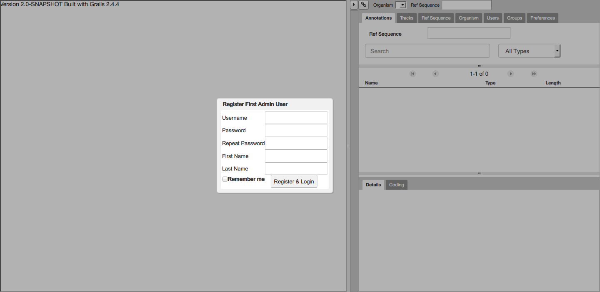
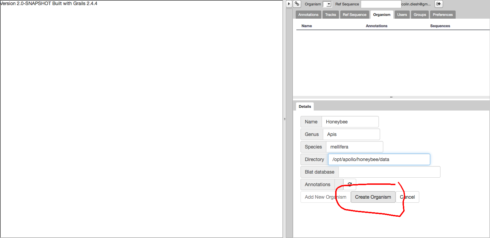
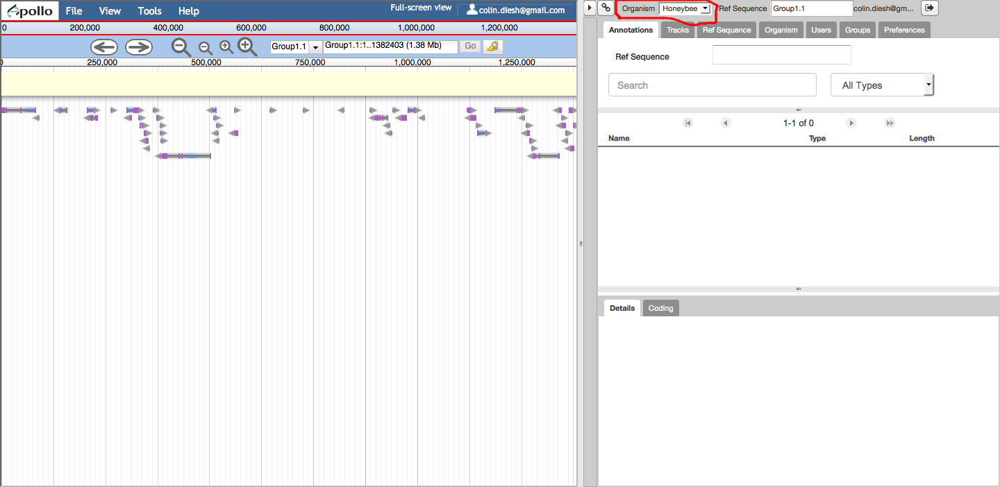

# Developer's guide

Here we will introduce how to setup Apollo on your server. In general, there are two modes of deploying Apollo.

There is "development mode" where the application is launched in a temporary server (automatically) and there is
"production mode", which will typically require an external separate database and tomcat server where you can deploy the
generated `war` file.

This guide will cover the "development mode" scenario which should be easy to start.  **To setup in a production environment, please see the [setup](Setup.md) guide.**

### Java / JDK

You have to install Java and the Java Development Kit (JDK) 8 or higher to run Apollo.  Both the Oracle and OpenJDK versions have been tested.

### Node.js / NPM

You will need to [install node.js](https://nodejs.org/en/download/), which includes NPM (the node package manager) to build Apollo.

[nvm](https://github.com/creationix/nvm) is highly recommended for installing and managing multiple version of Node.
Node v6 and up should work, but we recommend Node v8 or better.

### Grails / Groovy / Gradle  (optional)

Installing Grails (application framework), Groovy (development language), or Gradle (build environment) is 
not required (they will install themselves), but it is suggested for doing development.  

This is most easily done by using [SDKMAN](http://sdkman.io/) (formerly GVM) which can automatically setup
grails for you. 

1. `curl -s http://get.sdkman.io | bash`
2. `sdk install grails 2.5.5`
3. `sdk install gradle 2.11`
4. `sdk install groovy`


### Get the code

To setup Apollo, you can download our [latest release](https://github.com/GMOD/Apollo/releases/latest) from our [official releases](https://github.com/GMOD/Apollo/releases/) as compressed zip or tar.gz file (link at the bottom).  

Alternatively you can check it out from git directly as follows:

1. `git clone https://github.com/GMOD/Apollo.git Apollo`
2. `cd Apollo`
3. `git checkout <XYZ>` - optional, where XYZ is the tagged version you want from here: https://github.com/GMOD/Apollo/releases

### Verify install requirements

We can now perform a quick-start of the application in "development mode" with this command:

``` 
./apollo run-local
```

The JBrowse and perl pre-requisites will be installed during this step, and if there is a success, then a temporary
server will be automatically launched at `http://localhost:8080/apollo`.

Note: You can also supply a port number e.g. `apollo run-local 8085` if there are conflicts on port 8080.

Also note: if there are any errors at this step, check the setup.log file for errors. You can refer to the
[troubleshooting guide](Troubleshooting.md) and often it just means the pre-requisites or perl modules failed.

Also also note: the "development mode" uses an in-memory H2 database for storing data by default. The setup guide will
show you how to configure custom database settings.

### Running the code

There are several distinct parts of the code.

1. Apollo client plugin (JS: [dojo](https://dojotoolkit.org/documentation/), jquery, etc.) in [client directory](../client)
1. Server ([Grails 2.5.5](http://docs.grails.org/2.5.5/): Groovy and Java) in [grails-app](../grails-app), [src](../src), [web components](../web-app) and [tests](../test).
1. Side-panel code / wrapper code ([GWT 2.8](http://www.gwtproject.org/doc/latest/DevGuide.html): Java).  Code is java and/or XML in [src/gwt](../src/gwt).
1. Tools / scripts in the [examples](web_services/examples) and [tools](../tools/data): Groovy, perl, bash
1. JBrowse (JS: [dojo](https://dojotoolkit.org/documentation/), jquery, etc.)

In general, the command `./apollo run-local` will build and run the client and the server code.  Subsequent runs that do not change the GWT code can use `./apollo run-app`.  Changes to domain objects or adding controller methods may make stopping and restarting the server necessary, but most other changes will compile without having to restart the server.

`./apollo test` runs the grails unit and integration [tests](../test).

Updating the web-service doc can be done with `./apollo create-rest-doc`


#### Running the code for the making client plugin changes

After starting the server you can run `./gradlew installJBrowseWebOnly` or `./apollo jbrowse` to push changes from the JavaScript code in the `client/apollo` directory. 

If for some reason this is not working then make sure that your network development tab, in your browser console, has disabled caching.  You can also run the command `./gradlew copy-resources-dev` manually each time instead if the files don't seem to be getting copied.


#### Running the code for GWT changes 

To use the GWT dev server run `gradle devmode` in a separate terminal.   This will bring up a separate [GWT dev-mode code server](http://www.gwtproject.org/doc/latest/DevGuideCompilingAndDebugging.html#dev_mode) that will compile subsequent changes to the [src/gwt](../src/gwt) code after reloading the page.  

If errors seem to be a little obtuse using the dev compilation, you might try running `./apollo compile` to get more detail.

#### Running the code for JBrowse changes

If you are testing making changes directly to JBrowse within Apollo, the following steps should work:

1. `./apollo clean-all`
1. Clone the version of jbrowse you want into a directory called `jbrowse-download` as the root level.
1. `./apollo run-local` to run the server
1. In a separate terminal run `gradle copy-resources-dev` to copy over your changes to the server.


#### Adding sample data

If you want to test with pre-processed data instead of [adding your own](Apollo2Build.md#adding-data-to-apollo) you can load the following data into a directory to be [added as an organism](Apollo2Build.md#login-to-the-web-interface).

- [Yeast from JBrowse sample data](https://s3.amazonaws.com/apollo-data/yeast.tgz) 0.5 MB
- [Volvox imaginary sample organism from JBrowse](https://s3.amazonaws.com/apollo-data/volvox.tgz) 2 MB
- [Honeybee without BAM](https://s3.amazonaws.com/apollo-data/data-amel-demo-nobam.tgz) 500 MB
- [Honeybee with BAM](https://s3.amazonaws.com/apollo-data/data-amel-demo.tgz) 17 GB

#### Using Apollo with IntelliJ

You can use Intellij, NetBeans, Eclipse, or just a simple text editor with Apollo to aid in development.  

Here we discuss using [IntelliJ Ultimate](https://www.jetbrains.com/idea/download/) with Apollo:

- Download [IntelliJ Ultimate](https://www.jetbrains.com/idea/download/) (you need the commercial version).  [Licensing options](https://www.jetbrains.com/store/terms/comparison.html). 
- Clone / download Apollo if you haven't already. `git clone https://github.com/GMOD/Apollo` and follow the instructions on building Apollo in this doc.
- If you've tried to use it before with IntelliJ, make sure that there is no `.idea` or `*.ipr` file present in the directory.
- Open IntelliJ 
- Select `Import Project`
- Select `Create from Existing Sources`
- After it detects the web-app it should have [detected `Web`](images/SelectGrails.png).  Select `Grails` instead.
- Note that there is a [`Grails` view](images/GrailsPackage.png) in the project menu.
- Open Terminal and run `./apollo run-local` to take care of all the dependencies, including JBrowse.  If you aren't developing GWT, you can use `./apollo run-app` instead.  Most Java / Groovy files will automatically recompile in a few seconds after you make changes.
- You can also run debug or run [directly from the IDE](images/GrailsDebug1.png) with [output below](images/GrailsDebug2.png).

Notes on Debugging:
- In IntelliJ, run debug (works only for JVM files, debug JavaScript in the browser)
- There is an [error in IntelliJ 2017.3](https://youtrack.jetbrains.com/issue/IDEA-182962) so either downgrade to 2017.2 or disable the Insrumenting agent in `File | Settings | Build, Execution, Deployment | Debugger | Async Stacktraces` in the preferences menu.


### Create server documentation

Using an IDE like IntelliJ, NetBeans, Eclipse etc. is highly recommended in conjunction with [Grails 2.5.X documentation](http://docs.grails.org/2.5.x/).
Additionally, you can generate documentation using grails:

    grails doc
    
Server documentation (for groovy) should be available at `target/docs/all-docs.html`.

## Setting up the application

### Setup a production server

**To setup in a production environment, please see the [setup](Setup.md) guide.**  To setup (as opposed to a development server as above), you must [properly configure a servlet container like Tomcat or Jetty](Setup.md) with [sufficient memory](Troubleshooting.md#tomcat-memory).

### Adding data to Apollo

After we have a server setup, we will want to add a new organism to the panel. If you are a new user, you will want to
setup this data with the jbrowse pre-processing scripts. You can see the [data loading guide](Data_loading.md) for more
details, but essentially, you will want to load a reference genome and an annotations file at a minimum:

``` 
bin/prepare-refseqs.pl --fasta yourgenome.fasta --out /opt/apollo/data

bin/flatfile-to-json.pl --gff yourannotations.gff --type mRNA \
        --trackLabel AnnotationsGff --out /opt/apollo/data
```


### Login to the web interface

After you access your application at http://localhost:8080/apollo/ then you will be prompted for login information



Figure 1. "Register First Admin User" screen allows you to create a new admin user.




Figure 2. Navigate to the "Organism tab" and select "Create new organism". Then enter the new information for your
organism. Importantly, the data directory refers to a directory that has been prepared with the JBrowse data loading
scripts from the command line. See the [data loading](Data_loading.md) section for details.



Figure 3. Open up the new organism from the drop down tab on the annotator panel.


## Conclusion

If you completed this setup, you can then begin adding new users and performing annotations. Please continue to the
[setup guide](Setup.md) for deploying the webapp to production or visit the [troubleshooting guide](Troubleshooting.md)
if you encounter problems during setup.
