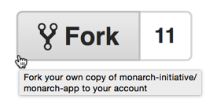
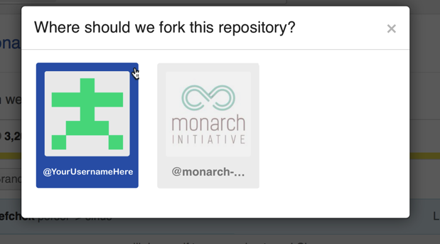
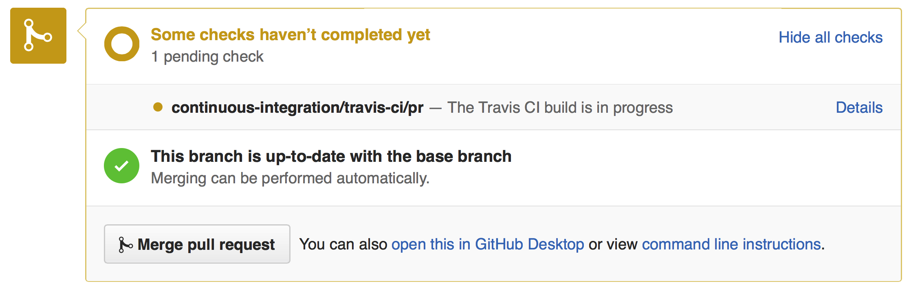

# How to contribute code to Apollo

##### Audience
These guidelines are for developers of Apollo software, whether internal or in the broader community. 

## Basic principles of the Apollo-flavored [GitHub Workflow](http://guides.github.com/overviews/flow/)

##### Principle 1: Work from a personal fork 
* Prior to adopting the workflow, a developer will perform a *one-time setup* to create a personal Fork of apollo and will subsequently perform their development and testing on a task-specific branch within their forked repo. This forked repo will be associated with that developer's GitHub account, and is distinct from the shared repo managed by GMOD.

##### Principle 2: Commit to personal branches of that fork
* Changes will never be committed directly to the master branch on the shared repo. Rather, they will be composed as branches within the developer's forked repo, where the developer can iterate and refine their code prior to submitting it for review.

##### Principle 3: Propose changes via pull request of personal branches
*  Each set of changes will be developed as a task-specific *branch* in the developer's forked repo, and then create a [pull request](https://github.com/GMOD/Apollo/compare) will be created to develop and propose changes to the shared repo. This mechanism provides a way for developers to discuss, revise and ultimately merge changes from the forked repo into the shared Apollo repo.

##### Principle 4: Delete or ignore stale branches, but don't recycle merged ones
*  Once a pull request has been merged, the task-specific branch is no longer needed and may be deleted or ignored. It is bad practice to reuse an existing branch once it has been merged. Instead, a subsequent branch and pull-request cycle should begin when a developer switches to a different coding task. 
*  You may create a pull request in order to get feedback, but if you wish to continue working on the branch, so state with "DO NOT MERGE YET".

## Table of contents

<!-- MarkdownTOC -->

- [One Time Setup - Forking a Shared Repo](#one-time-setup---forking-a-shared-repo)
    - [Step 1 - Backup your existing repo (optional)](#step-1---backup-your-existing-repo-optional)
    - [Step 2 - Fork `apollo` via the Web](#step-2---fork-apollo-via-the-web)
    - [Step 3 - Clone the Fork Locally](#step-3---clone-the-fork-locally)
    - [Step 4 - Configure the local forked repo](#step-4---configure-the-local-forked-repo)
    - [Step 5 - Configure  `.bashrc` to show current branch (optional)](#step-5---configure--bashrc-to-show-current-branch-optional)
- [Typical Development Cycle](#typical-development-cycle)
    - [Refresh and clean up local environment](#refresh-and-clean-up-local-environment)
        - [Step 1 - Fetch remotes](#step-1---fetch-remotes)
        - [Step 2 - Ensure that 'master' is up to date](#step-2---ensure-that-master-is-up-to-date)
    - [Create a new branch](#create-a-new-branch)
    - [Changes, Commits and Pushes](#changes-commits-and-pushes)
    - [Reconcile branch with upstream changes](#reconcile-branch-with-upstream-changes)
        - [Fetching the upstream branch](#fetching-the-upstream-branch)
        - [Rebasing to avoid Conflicts and Merge Commits](#rebasing-to-avoid-conflicts-and-merge-commits)
        - [Dealing with merge conflicts during rebase](#dealing-with-merge-conflicts-during-rebase)
        - [Advanced: Interactive rebase](#advanced-interactive-rebase)
    - [Submitting a PR (pull request)](#submitting-a-pr-pull-request)
    - [Reviewing a pull request](#reviewing-a-pull-request)
    - [Respond to TravisCI tests](#respond-to-travisci-tests)
    - [Respond to peer review](#respond-to-peer-review)
    - [Repushing to a PR branch](#repushing-to-a-pr-branch)
    - [Merge a pull request](#merge-a-pull-request)
    - [Celebrate and get back to work](#celebrate-and-get-back-to-work)
- [GitHub Tricks and Tips](#github-tricks-and-tips)
- [References and Documentation](#references-and-documentation)

<!-- /MarkdownTOC -->

## One Time Setup - Forking a Shared Repo

The official shared ``Apollo`` repository is intended to be modified solely via pull requests that are reviewed and merged by a set of responsible 'gatekeeper' developers within the Apollo development team. These pull requests are initially created as task-specific named branches within a developer's personal forked repo.

Typically, a developer will fork a shared repo once, which creates a personal copy of the repo that is associated with the developer's GitHub account. Subsequent pull requests are developed as branches within this personal forked repo. The repo need never be forked again, although each pull request will be based upon a new named branch within this forked repo.

### Step 1 - Backup your existing repo (optional)

The Apollo team has recently adopted the workflow described in this document. Many developers will have an existing clone of the shared repo that they have been using for development. This cloned local directory must be *moved aside* so that a proper clone of the forked repo can be used instead.

*If you do not have an existing local copy of the shared repo, then skip to [Step 2](#step-2---fork-apollo-via-the-web) below.*

### Step 2 - Fork `apollo` via the Web

The easiest way to fork the `apollo` repository is via the GitHub web interface:

- Ensure you are logged into GitHub as your GitHub user.
- Navigate to the apollo shared repo at [https://github.com/GMOD/apollo](https://github.com/GMOD/apollo).
- Notice the 'Fork' button in the upper right corner. It has a number to the right of the button.

- Click the Fork button. The resulting behavior will depend upon whether your GitHub user is a member of a GitHub organization. If not a member of an organization, then the fork operation will be performed and the forked repo will be created in the user's account.
- If your user is a member of an organization (e.g., GMOD or acme-incorporated), then GitHub will present a dialog for the user to choose where to place the forked repo. The user should click on the icon corresponding to their username.

- *If you accidentally click the number, you will be on the Network Graphs page and should go back.*

### Step 3 - Clone the Fork Locally

At this point, you will have a fork of the shared repo (e.g., apollo) stored within GitHub, but it is not yet available on your local development machine. This is done as follows:

    # Assumes that directory ~/MI/ will contain your Apollo repos.
    # Assumes that your username is MarieCurie.
    # Adapt these instructions to suit your environment
    > cd ~/MI
    > git clone git@github.com:MarieCurie/apollo.git
    > cd apollo

Notice that we are using the SSH transport to clone this repo, rather than the HTTPS transport. The telltale indicator of this is the `git@github.com:MarieCurie...` rather than the alternative `https://github.com/MarieCurie...`.

*Note: If you encounter difficulties with the above `git clone`, you may need to associate your local public SSH key with your GitHub account. See [Which remote URL should I use?](https://help.github.com/articles/which-remote-url-should-i-use/) for information.*

### Step 4 - Configure the local forked repo

The `git clone` above copied the forked repo locally, and configured the symbolic name 'origin' to point back to the *remote* GitHub fork. We will need to create an additional *remote* name to point back to the shared version of the repo (the one that we forked in Step 2). The following should work:

    # Assumes that you are already in the local apollo directory
    > git remote add upstream https://github.com/GMOD/apollo.git

Verify that remotes are configured correctly by using the command `git remote -v`. The output should resemble:

    upstream    https://github.com/GMOD/apollo.git (fetch)
    upstream    https://github.com/GMOD/apollo.git (push)
    origin  git@github.com:MarieCurie/apollo.git (fetch)
    origin  git@github.com:MarieCurie/apollo.git (push)

### Step 5 - Configure  `.bashrc` to show current branch (optional)

One of the important things when using Git is to know what branch your working directory is tracking. This can be easily done with the `git status` command, but checking your branch periodically can get tedious. It is easy to configure your `bash` environment so that your current git branch is always displayed in your bash prompt.

If you want to try this out, add the following to your `~/.bashrc` file:

    function parse_git_branch()
    {
      git branch 2> /dev/null | sed -e '/^[^*]/d' -e 's/* \(.*\)/ \1/'
    }
    LIGHT_GRAYBG="\[\033[0;47m\]"
    LIGHT_PURPLE="\[\033[0;35m\]"
    NO_COLOR="\[\033[0m\]"
    export PS1="$LIGHT_PURPLE\w$LIGHT_GRAYBG\$(parse_git_branch)$NO_COLOR \$ "

You will need to open up a new Terminal window (or re-login to your existing terminal) to see the effect of the above `.bashrc` changes.

If you cd to a git working directory, the branch will be displayed in the prompt. For example:

    ~ $
    ~ $ # This isn't a git directory, so no branch is shown
    ~ $
    ~ $ cd /tmp
    /tmp $
    /tmp $ # This isn't a git directory, so no branch is shown
    /tmp $
    /tmp $ cd ~/MI/apollo/
    ~/MI/apollo fix-feedback-button $
    ~/MI/apollo fix-feedback-button $ # The current branch is shown
    ~/MI/apollo fix-feedback-button $
    ~/MI/apollo fix-feedback-button $ git status
    On branch fix-feedback-button
    Changes not staged for commit:
      (use "git add <file>..." to update what will be committed)
      (use "git checkout -- <file>..." to discard changes in working directory)
        ... remaining output of git status elided ...

---

## Typical Development Cycle

Once you have completed the One-time Setup above, then it will be possible to create new branches and pull requests using the instructions below. The typical development cycle will have the following phases:

- Refresh and clean up local environment
- Create a new task-specific branch
- Perform ordinary development work, periodically committing to the branch
- Prepare and submit a Pull Request (PR) that refers to the branch
- Participate in PR Review, possibly making changes and pushing new commits to the branch
- Celebrate when your PR is finally Merged into the shared repo.
- Move onto the next task and repeat this cycle

### Refresh and clean up local environment

Git will not automatically sync your Forked repo with the original shared repo, and will not automatically update your local copy of the Forked repo. These tasks are part of the developer's normal *cycle*, and should be the first thing done prior to beginning a new development effort and creating a new branch. In addition, this

#### Step 1 - Fetch remotes

In the (likely) event that the *upstream* repo (the apollo shared repo) has changed since the developer last began a task, it is important to update the local copy of the upstream repo so that its changes can be incorporated into subsequent development.

    > git fetch upstream        # Updates the local copy of shared repo BUT does not affect the working directory, it simply makes the upstream code available locally for subsequent Git operations. See step 2.

#### Step 2 - Ensure that 'master' is up to date

Assuming that new development begins with branch 'master' (a good practice), then we want to make sure our local 'master' has all the recent changes from 'upstream'. This can be done as follows:

    > git checkout master
    > git reset --hard upstream/master

The above command is potentially dangerous if you are not paying attention, as it will remove any local commits to master (which you should not have) as well as any changes to local files that are also in the upstream/master version (which you should not have). In other words, the above command ensures a proper clean slate where your local master branch is identical to the upstream master branch.

Some people advocate the use of `git merge upstream/master` or `git rebase upstream/master` instead of the `git reset --hard`. One risk of these options is that unintended local changes accumulate in the branch and end up in an eventual pull request. Basically, it leaves open the possibility that a developer is not really branching from upstream/master, but is branching from some developer-specific branch point.

### Create a new branch

Once you have updated the local copy of the master branch of your forked repo, you can create a named branch from this copy and begin to work on your code and pull-request. This is done with:

    > git checkout -b fix-feedback-button   # This is an example name

This will create a local branch called 'fix-feedback-button' and will configure your working directory to track that branch instead of 'master'.

You may now freely make modifications and improvements and these changes will be accumulated into the new branch when you commit.

If you followed the instructions in [Step 5 - Configure  `.bashrc` to show current branch (optional)](#step-5---configure--bashrc-to-show-current-branch-optional), your shell prompt should look something like this:

    ~/MI/apollo fix-feedback-button $

### Changes, Commits and Pushes

Once you are in your working directory on a named branch, you make changes as normal. When you make a commit, you will be committing to the named branch by default, and not to master.

You may wish to periodically `git push` your code to GitHub. Note the use of an explicit branch name that matches the branch you are on (this may not be necessary; a git expert may know better):

    > git push origin fix-feedback-button   # This is an example name

Note that we are pushing to 'origin', which is our forked repo. We are definitely NOT pushing to the shared 'upstream' remote, for which we may not have permission to push.

### Reconcile branch with upstream changes

If you have followed the instructions above at [Refresh and clean up local environment](#refresh-and-clean-up-local-environment), then your working directory and task-specific branch will be based on a starting point from the latest-and-greatest version of the shared repo's master branch. Depending upon how long it takes you to develop your changes, and upon how much other developer activity there is, it is possible that changes to the upstream master will conflict with changes in your branch.

So it is a good practice to periodically pull down these upstream changes and reconcile your task branch with the upstream master branch. At the least, this should be performed prior to submitting a PR.

#### Fetching the upstream branch

The first step is to fetch the update upstream master branch down to your local development machine. Note that this command will NOT affect your working directory, but will simply make the upstream master branch available in your local Git environment.

    > git fetch upstream

#### Rebasing to avoid Conflicts and Merge Commits

Now that you've fetched the upstream changes to your local Git environment, you will use the `git rebase` command to adjust your branch

    > # Make that your changes are committed to your branch
    > # before doing any rebase operations
    > git status
        # ... Review the git status output to ensure your changes are committed
        # ... Also a good chance to double-check that you are on your
        # ... task branch and not accidentally on master
    > git rebase upstream/master

The rebase command will have the effect of adjusting your commit history so that your task branch changes appear to be based upon the most recently fetched master branch, rather than the older version of master you may have used when you began your task branch.

By periodically rebasing in this way, you can ensure that your changes are in sync with the rest of Apollo development and you can avoid hassles with merge conflicts during the PR process.

#### Dealing with merge conflicts during rebase

Sometimes conflicts happen where another developer has made changes and committed them to the upstream master (ideally via a successful PR) and some of those changes overlap with the code you are working on in your branch. The `git rebase` command will detect these conflicts and will give you an opportunity to fix them before continuing the rebase operation. The Git instructions during rebase should be sufficient to understand what to do, but a very verbose explanation can be found at [Rebasing Step-by-Step](http://gitforteams.com/resources/rebasing.html)

#### Advanced: Interactive rebase

As you gain more confidence in Git and this workflow, you may want to create PRs that are easier to review and best reflect the intent of your code changes. One technique that is helpful is to use the *interactive rebase* capability of Git to help you clean up your branch prior to submitting it as a PR. This is completely optional for novice Git users, but it does produce a nicer shared commit history.

See [squashing commits with rebase](http://gitready.com/advanced/2009/02/10/squashing-commits-with-rebase.html) for a good explanation.

### Submitting a PR (pull request)

Once you have developed code and are confident it is ready for review and final integration into the upstream version, you will want to do a final `git push origin ...` (see Changes, Commits and Pushes above). Then you will use the GitHub website to perform the operation of creating a Pull Request based upon the newly pushed branch.

See [submitting a pull request](https://help.github.com/articles/creating-a-pull-request).

### Reviewing a pull request

The set of open PRs for the apollo can be viewed by first visiting the shared apollo GitHub page at [https://github.com/GMOD/apollo](https://github.com/GMOD/apollo).

Click on the 'Pull Requests' link on the right-side of the page:

Note that the Pull Request you created from your forked repo shows up in the shared repo's Pull Request list. One way to avoid confusion is to think of the shared repo's PR list as a queue of changes to be applied, pending their review and approval.

### Respond to TravisCI tests

The GitHub Pull Request mechanism is designed to allow review and refinement of code prior to its final merge to the shared repo. After creating your Pull Request, the TravisCI tests for apollo will be executed automatically, ensuring that the code that 'worked fine' on your development machine also works in the production-like environment provided by TravisCI. The current status of the tests can be found near the bottom of the individual PR page, to the right of the Merge Request symbol:

TBD - Something should be written about developers running tests PRIOR to TravisCI and the the PR. This may already be in the README.md, but should be cited.

### Respond to peer review

The GitHub Pull Request mechanism is designed to allow review and refinement of code prior to its final merge to the shared repo. After creating your Pull Request, the TravisCI tests for apollo will be executed automatically, ensuring that the code that 'worked fine' on your development machine also works in the production-like environment provided by TravisCI. The current status of the tests can be found

### Repushing to a PR branch

It's likely that after created a Pull Request, you will receive useful peer review or your TravisCI tests will have failed. In either case, you will make the required changes on your development machine, retest your changes, and you can then push your new changes back to your task branch and the PR will be automatically updated. This allows a PR to evolve in response to feedback from peers. Once everyone is satisfied, the PR may be merged. (see below).

### Merge a pull request

One of the goals behind the workflow described here is to enable a large group of developers to meaningfully contribute to the Apollo codebase. The Pull Request mechanism encourages review and refinement of the proposed code changes. As a matter of informal policy, Apollo expects that a PR will not be merged by its author and that a PR will not be merged without at least one reviewer approving it (via a comment such as +1 in the PR's Comment section).

### Celebrate and get back to work

You have successfully gotten your code improvements into the shared repository. Congratulations! The branch you created for this PR is no longer useful, and may be deleted from your forked repo or may be kept. But in no case should the branch be further developed or reused once it has been successfully merge. Subsequent development should be on a new branch. Prepare for your next work by returning to [Refresh and clean up local environment](#refresh-and-clean-up-local-environment).

---

## GitHub Tricks and Tips

- Add `?w=1` to a GitHub file compare URL to ignore whitespace differences.

## References and Documentation

- The instructions presented here are derived from several sources. However, a very readable and complete article is [Using the Fork-and-Branch Git Workflow](http://blog.scottlowe.org/2015/01/27/using-fork-branch-git-workflow/). Note that the article doesn't make clear that certain steps like Forking are one-time setup steps, after which Branch-PullRequest-Merge steps are used; the instructions below will attempt to clarify this.

- New to GitHub? The [GitHub Guides](http://guides.github.com) are a great place to start.

- Advanced GitHub users might want to check out the [GitHub Cheat Sheet](https://github.com/tiimgreen/github-cheat-sheet/blob/master/README.md)

