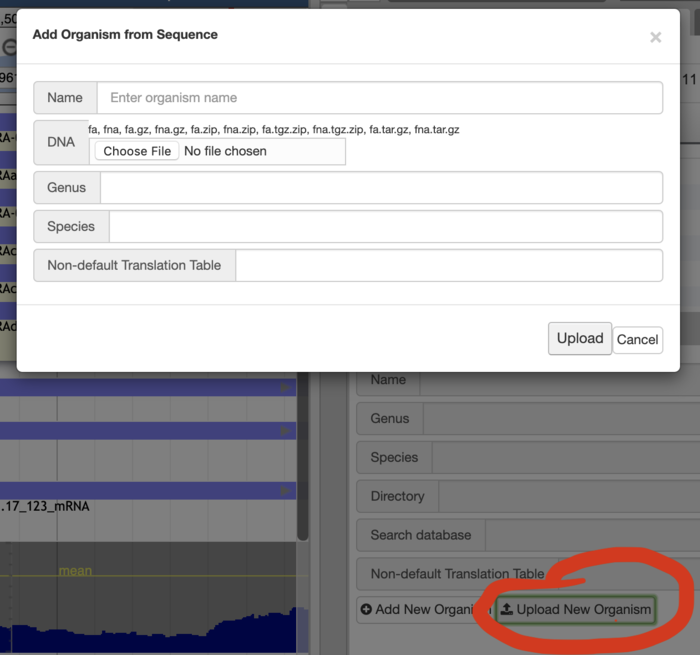
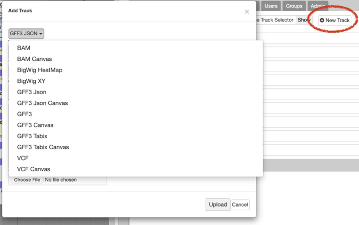

# Data generation pipeline

Using the methods below you can generate and update a `trackList.json` and then make any further manual required. 

## Canvas vs HTML in Apollo

Most of the [JBrowse documentation for configuring tracks](https://jbrowse.org/docs/reference_sequence.html) applies here.  However, there are a few important points about Canvas vs HTML tracks.

It should be noted that if you need both benefits of each track type, you are free to duplicate that track and use an alternate styling or track type.

BigWig tracks are only shown as Canvas.

#### [HTML Tracks](https://jbrowse.org/docs/html_features.html)

Pros:  Create evidence by dragging and clicking on annotation or evidence does show the alignment.  Can use CSS styling.
Cons:  Renders slower.

Note that in most cases regular HTML rendering will be preferable.  Exceptions would be dense BAM alignments and dense Variant tracks where you are attempting to display the density at a higher resolution.

<u>HTML Track mapping with type=<?> </u>:
- Annotation / GFF3: `FeatureTrack`,`NeatHTMLFeatures/View/Track/NeatFeature`, `JBrowse/View/Track/HTMLFeatures`, `WebApollo/View/Track/DraggableNeatHTMLFeatures`
- Alignment: `JBrowse/View/Track/Alignments`,`WebApollo/View/DraggableAlignments`
- Variant: `JBrowse/View/Track/HTMLVariants`,`WebApollo/View/Track/WebApolloHTMLVariants`


#### [Canvas Tracks](https://jbrowse.org/docs/canvas_features.html)

Pros:  Renders faster, non-CSS style options. 
Cons:  Can not drag to create evidence, clicking on annotation or evidence does not show alignment. 

Note that in most cases regular HTML rendering will be preferable.  Exceptions would be dense BAM alignments and dense Variant tracks where you are attempting to display the density at a higher resolution.

<u>Canvas Track mapping with type=<?> </u>:
- Annotation / GFF3: `NeatCanvasFeatures/View/Track/NeatFeature`, `JBrowse/View/Track/CanvasFeatures`, `WebApollo/View/Track/WebApolloNeatCanvasFeatures`
- Alignment: `JBrowse/View/Track/Alignments2`,`WebApollo/View/Track/WebApolloAlignments2`
- Variant: `JBrowse/View/Track/CanvasVariants`,`WebApollo/View/Track/WebApolloCanvasVariants`


## Apollo Automated Configuration and upload

Admin users may upload FASTA files to create new genomes and upload most track types in a similar manner if a default configuration is desirable.   



Additionally admin users may also add most tracks in a similar fashion:




## JBrowse Configuration

The manual data generation pipeline is based on the typical jbrowse commands such as prepare-refseqs.pl and
flatfile-to-json.pl, and these scripts are automatically copied to a local bin/ directory when you run the setup scripts
(e.g. `apollo run-local` or `apollo deploy` or `install_jbrowse.sh`).

If you don't see a bin/ subdirectory containing these scripts after running the setup, check setup.log and check the
[troubleshooting guide](Troubleshooting.md) for additional tips or feel free to post the error and setup.log on GitHub
or the mailing list.

### prepare-refseqs.pl

The first step to setup the genome browser is to load the reference genome data. We'll use the `prepare-refseqs.pl`
script to output to the data directory.

``` 
bin/prepare-refseqs.pl --fasta pyu_data/scf1117875582023.fa --out /opt/apollo/data
```

If you want to use an indexed FASTA genome then you can run prepare-refseqs.pl as follows:

```
bin/prepare-refseqs.pl --indexed_fasta pyu_data/scf1117875582023.fa --out /opt/apollo/data
```

The script will copy the genome FASTA and its FAI index into the output folder.

Note: the output directory is used later when we load the organism into the browser with the "Create organism" form

### flatfile-to-json.pl

The flatfile-to-json.pl script can be used to load GFF3 files and you can customize the feature types. Here, we'll start
off by loading data from the MAKER GFF for the Pythium ultimum data. The simplest loading command specifies a
--trackLabel, the --type of feature to load, the --gff file and the --out directory.

``` 
bin/flatfile-to-json.pl --gff pyu_data/scf1117875582023.gff --type mRNA \
        --trackLabel MAKER --out /opt/apollo/data
```
 
Note: you can also use the command `bin/maker2jbrowse` for loading the MAKER data.

Also see the section [Customizing features](Data_loading.md#customizing-features) section for more information on
customizing the CSS styles of the Apollo features.

Note: Apollo uses features that are loaded at the "transcript" level. If your GFF3 has "gene" features with
"transcript"/"mRNA" child features, make sure that you use the argument --type mRNA or --type transcript.


### generate-names.pl

Once data tracks have been created, you can generate a searchable index of names using the generate-names.pl script:

``` 
bin/generate-names.pl --verbose --out /opt/apollo/data
```

This is optional but useful step to index of names and features and refseq names. If you have some tracks that have
millions of features, consider only indexing select tracks with the --tracks argument or disabling autocomplete with
 `--completionLimit 0`.

### add-bam-track.pl

Apollo natively supports BAM files and the file can be read (in chunks) directly from the server with no
preprocessing.

To add a BAM track, copy the .bam and .bam.bai files to your data directory, and then use the add-bam-track.pl to add
the file to the tracklist.

``` 
mkdir /opt/apollo/data/bam
cp pyu_data/simulated-sorted.bam /opt/apollo/data/bam
cp pyu_data/simulated-sorted.bam.bai /opt/apollo/data/bam
bin/add-bam-track.pl --bam_url bam/simulated-sorted.bam \
   --label simulated_bam --key "simulated BAM" -i /opt/apollo/data/trackList.json
```


Note: the `bam_url` parameter is a URL that is relative to the data directory. It is not a filepath! Also, the .bai will
automatically be located if it is simply the .bam with .bai appended to it.

### add-bw-track.pl

Apollo also has native support for BigWig files (.bw), so no extra processing of these files is required either.

To use this, copy the BigWig data into the jbrowse data directory and then use the add-bw-track.pl to add the file to
the tracklist.

``` 
mkdir /opt/apollo/data/bigwig
cp pyu_data/*.bw /opt/apollo/data/bigwig
bin/add-bw-track.pl --bw_url bigwig/simulated-sorted.coverage.bw \
    --label simulated_bw --key "simulated BigWig"
```

Note: the `bw_url` parameter is a URL that is relative to the data directory. It is not a filepath!

### Customizing different annotation types (advanced)

To change how the different annotation types look in the "User-created annotation" track, you'll need to update the
mapping of the annotation type to the appropriate CSS class. This data resides in `client/apollo/json/annot.json`, which
is a file containing Apollo tracks that is loaded by default. You'll need to modify the JSON entry whose label is
`Annotations`. Of particular interest is the `alternateClasses` element. Let's look at that default element:

``` 
"alternateClasses": {
    "pseudogene" : {
       "className" : "light-purple-80pct",
       "renderClassName" : "gray-center-30pct"
    },
    "tRNA" : {
       "className" : "brightgreen-80pct",
       "renderClassName" : "gray-center-30pct"
    },
    "snRNA" : {
       "className" : "brightgreen-80pct",
       "renderClassName" : "gray-center-30pct"
    },
    "snoRNA" : {
       "className" : "brightgreen-80pct",
       "renderClassName" : "gray-center-30pct"
    },
    "ncRNA" : {
       "className" : "brightgreen-80pct",
       "renderClassName" : "gray-center-30pct"
    },
    "miRNA" : {
       "className" : "brightgreen-80pct",
       "renderClassName" : "gray-center-30pct"
    },
    "rRNA" : {
       "className" : "brightgreen-80pct",
       "renderClassName" : "gray-center-30pct"
    },
    "repeat_region" : {
       "className" : "magenta-80pct"
    },
    "transposable_element" : {
       "className" : "blue-ibeam",
       "renderClassName" : "blue-ibeam-render"
    }
}
```

For each annotation type, you can override the default class mapping for both `className` and `renderClassName` to use
another CSS class. Check out the [Customizing features](Data_loading.md#customizing-features) section for more
information on customizing the CSS classes.

### Customizing features

The visual appearance of biological features in Apollo (and JBrowse) is handled by CSS stylesheets with HTMLFeatures
tracks. Every feature and subfeature is given a default CSS "class" that matches a default CSS style in a CSS
stylesheet. These styles are are defined in `client/apollo/css/track_styles.css` and
`client/apollo/css/webapollo_track_styles.css`. Additional styles are also defined in these files, and can be used by
explicitly specifying them in the --className, --subfeatureClasses, --renderClassname, or --arrowheadClass parameters to
flatfile-to-json.pl ([see data loading section](Data_loading.md#flatfile-to-json.pl_transcripts)).

Apollo differs from JBrowse in some of it's styling, largely in order to help with feature selection, edge-matching,
and dragging. Apollo by default uses invisible container elements (with style class names like "container-16px") for
features that have children, so that the children are fully contained within the parent feature. This is paired with
another styled element that gets rendered *within* the feature but underneath the subfeatures, and is specified by the
`--renderClassname` argument to `flatfile-to-json.pl`. Exons are also by default treated as special invisible
containers, which hold styled elements for UTRs and CDS.

It is relatively easy to add other stylesheets that have custom style classes that can be used as parameters to
`flatfile-to-json.pl`. For example, you can create `/opt/apollo/data/custom_track_styles.css` which contains two new
styles:

``` 
    .gold-90pct, 
    .plus-gold-90pct, 
    .minus-gold-90pct  {
        background-color: gold;
        height: 90%;
        top: 5%;
        border: 1px solid gray;
    }

    .dimgold-60pct, 
    .plus-dimgold-60pct, 
    .minus-dimgold-60pct  {
        background-color: #B39700;
        height: 60%;
        top: 20%;
    }
```


In this example, two subfeature styles are defined, and the *top* property is being set to (100%-height)/2 to assure
that the subfeatures are centered vertically within their parent feature. When defining new styles for features, it is
important to specify rules that apply to plus-*stylename* and minus-*stylename* in addition to *stylename*, as Apollo
adds the "plus-" or "minus-" to the class of the feature if the the feature has a strand orientation.

You need to tell Apollo where to find these styles by modifying the JBrowse config or the plugin config, e.g. by
adding this to the trackList.json

``` 
    "css" : "data/custom_track_styles.css"
```

Then you may use these new styles using --subfeatureClasses, which uses the specified CSS classes for your features in
the genome browser, for example:

``` 
    bin/flatfile-to-json.pl --gff MyFile.gff \
       --type mRNA --trackLabel MyTrack      \
       --subfeatureClasses '{"CDS":"gold-90pct","UTR": "dimgold-60pct"}'
```

### Bulk loading annotations to the user annotation track

#### GFF3

You can use the `tools/data/add_features_from_gff3_to_annotations.pl` script to bulk load GFF3 files with transcripts
to the user annotation track. Let's say we want to load our `maker.gff` transcripts.

``` 
    tools/data/add_features_from_gff3_to_annotations.pl \
        -U localhost:8080/Apollo -u web_apollo_admin -p web_apollo_admin \
        -i scf1117875582023.gff -t mRNA -o "name of organism"
```


The default options should be able to handle most GFF3 files that contain genes, transcripts, and exons.

You can still use this script even if the GFF3 file that you are loading does not contain transcripts and exon types.
Let's say we want to load `match` and `match_part` features as transcripts and exons respectively. We'll use the
`blastn.gff` file as an example.

``` 
    tools/data/add_features_from_gff3_to_annotations.pl \
       -U localhost:8080/Apollo -u web_apollo_admin -p web_apollo_admin \
       -i cf1117875582023.gff -t match -e match_part -o "name of organism"
```


You can view the add_features_from_gff3_to_annotations.pl help (`-h`) option for all available options.

**Note:** Apollo makes a clear distinction between a transcript and an mRNA. Genes that have mRNA as its child feature
are treated as protein coding annotations and Genes that have transcript as its child feature are treated as non-coding
annotations, specifically a pseudogene.

**Note:** In order to create meaningful names from your evidence when creating manual annotations, the GFF3 should 
provide the `Name` attribute in column 9 of the [GFF3 spec](https://github.com/The-Sequence-Ontology/Specifications/blob/master/gff3.md) as shown in this example:

    NC_000001.11    BestRefSeq      gene    11874   14409   .       +       .       ID=gene1;Name=DDX11L1;Dbxref=GeneID:100287102,HGNC:37102;description=DEAD%2FH %28Asp-Glu-Ala-Asp%2FHis%29 box helicase 11 like 1;gbkey=Gene;gene=DDX11L1;pseudo=true


If you would like to look at a compatible representative GFF3, export annotations from Apollo via GFF3 export.

### Disable draggable


Apollo has a number of specific track config parameters

``` 
overrideDraggable (boolean)
determines whether to transform the alignments tracks to draggable alignments

overridePlugins (boolean)
determines whether to transform alignments and sequence tracks
```

These can be specified on a specific track or in a global config.
