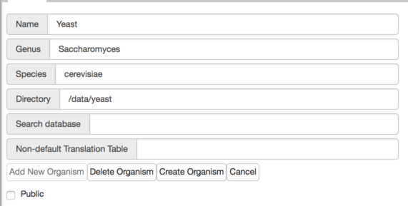

# Using Docker to Run Apollo

You can [install Docker](https://docs.docker.com/engine/installation/) for your system if not previously done.  

## Running the Container

You can see Apollo straight away:

    docker run -it -p 8888:8080 gmod/apollo:stable -v /jbrowse/root/directory/:/data

Open [http://localhost:8888](http://localhost:8888) in a web browser and login with admin@local.host / password to get started.

Note: data is not guaranteed to be saved in this manner, but data is `/jbrowse/root/directory` will not be written to either.  


## Production

To **run in production** against **persistent** JBrowse data and a **persistent** database you should:
- `docker pull gmod/apollo` if running `latest` build to guarantee you are using the latest build (not necessary for point releases).
- Create an empty directory for database data, e.g. `/postgres/data/directory` if you want to save data if the image goes down.
- If you want to upload tracks and genomes directories, create an empty directory for that, e.g., `/jbrowse/root/apollo_data`
- Put JBrowse data in a directory, e.g. `/jbrowse/root/directory/`.
- If publicly visible set a username and password

```
    docker run -it  \
    -v /jbrowse/root/directory/:/data  \
    -v /postgres/data/directory:/var/lib/postgresql  \
    -v /jbrowse/root/apollo_data:/data/temporary/apollo_data \
    -e APOLLO_ADMIN_EMAIL=adminuser \
    -e APOLLO_ADMIN_PASSWORD=superdupersecretpassword \
    -p 8888:8080 gmod/apollo:latest
```    

- As above, open [http://localhost:8888](http://localhost:8888) in a browser to begin [setting up Apollo](UsersGuide.md).

### Additional configuration

See [docker run instructions](https://docs.docker.com/engine/reference/run/) to run as a daemon (`-d`) and with a fresh container each time (`--rm`) depending on your use-case.

Additional options could be to set memory (required for running production off a mac) ` --memory=4g`, running a docker daemon `d` or adding debugging to the server ` -e "WEBAPOLLO_DEBUG=true"`.  For example (after creating the local `apollo_shared_dir`): 

    docker run --memory=4g -d -it -p 8888:8080 -v `pwd`/apollo_shared_dir/:`pwd`/apollo_shared_dir/ -e "WEBAPOLLO_DEBUG=true"  -v /postgres/data/directory:/var/lib/postgresql gmod/apollo:latest 

You can configure additional options by setting environmental variables for [docker apollo-config.groovy](https://github.com/GMOD/Apollo/blob/develop/docker-files/docker-apollo-config.groovy) by passing 
through via [multiple `-e` parameters](https://vsupalov.com/docker-arg-env-variable-guide/).

For example:
- Change the root path of the url (e.g., <http://localhost:8888/otherpath>) by adding the argument `-e APOLLO_PATH=otherpath` when running.


NOTE: If you don't use a locally mounted PostgreSQL database (e.g., creating an empty directory and mounting using `-v postgres-data:/var/lib/postgresql`)
or [set appropriate environment variables](https://docs.docker.com/engine/reference/commandline/run/) for a remote database 
( see variables [defined here](https://github.com/GMOD/Apollo/blob/develop/docker-files/launch.sh)) your annotations and setup may not be persisted.


### Notes on releases and availability

The image is available on [docker hub](https://hub.docker.com/r/gmod/apollo).

On docker hub you always pull from `gmod/apollo:release-<version>` where version is something like 2.6.2.

#### Versions

On docker hub versions are `stable` is the `master` branch or the latest stable release  (e.g., 2.6.0), `latest` is the checkin, which has not necessarily been thoroughly tested and `release-X.Y.Z` represents the release of the tag `X.Y.Z` (e.g., `release-2.6.0`).   

quay.io mirrors tags and all branches directly.  So `master` is `master` and `X.Y.Z` is the same.  So `quay.io/<user or orgname>/apollo:2.6.0` is the same as `<user or org name>/apollo:release-2.6.0`, but you'll have to fork your own version

See what is avaiable for [docker hub builds](https://hub.docker.com/r/gmod/apollo/tags).


### Logging In

The default credentials in this image are:

| Credentials |                    |
| ---         | ------------------ |
| Username    | `admin@local.host` |
| Password    | `password`         |


### Example Workflow


1. Make the following directories somewhere with write permissions: `postgres-data` and `jbrowse-data`. 
1. Copy your jbrowse data into `jbrowse-data`.  We provide [working sample data](http://genomearchitect.readthedocs.io/en/latest/Apollo2Build.html#adding-sample-data).
1. Run the docker-command:  `docker run -it -v /absolute/path/to/jbrowse-data:/data -v /absolute/path/to/postgres-data:/var/lib/postgresql -p 8888:8080 gmod/apollo:latest`
1. Login to the server at `http://localhost:8888/`
1. Add an organism per the [instructions under Figure 2](http://genomearchitect.readthedocs.io/en/latest/Apollo2Build.html#login-to-the-web-interface).   Using yeast as an example, if you copy the data into `jbrowse-data/yeast` then on the server 
you'll add the directory: `/data/yeast`. 




### Running your own preloaded data in a fork

Here is an example of running pre-loaded data from Apollo: https://github.com/alliance-genome/agr_apollo_container

Note that important changes here are in:

- [the Docker file](https://github.com/alliance-genome/agr_apollo_container/blob/master/Dockerfile#L88-L92)
- [adding a database dump script in the docker file](https://github.com/alliance-genome/agr_apollo_container/blob/master/Dockerfile#L59)
- [loading the database dump script](https://github.com/alliance-genome/agr_apollo_container/blob/master/docker-files/launch.sh#L70)

To create this we loaded the original, configured as we wanted and dumped the sql file out. 

