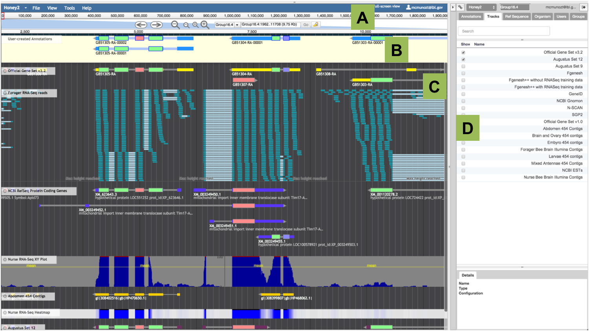
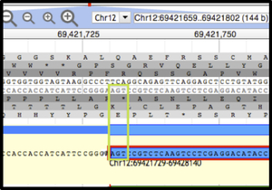
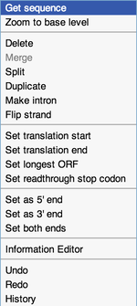
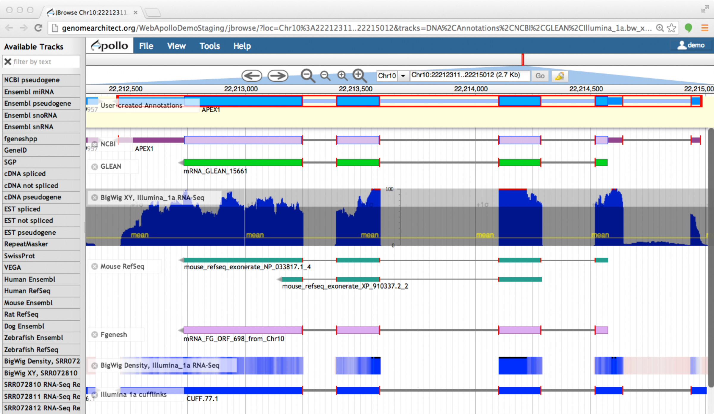

# User's Guide

This guide allows users to:

* Become familiar with the environment of the Apollo annotation tool.
* Understand Apollo’s functionality for the process of manual annotation.
* Learn to corroborate and modify computationally predicted gene models using all available gene predictions and biological evidence available in Apollo.
* Navigate through this user guide using the 'Table of Contents' at the bottom of this page.

--- 

## General Information

### General Process of Manual Annotation

The major steps of manual annotation using Apollo can be summarized as follows:

* Locate a chromosomal region of interest.
* Determine whether a feature in an existing evidence track provides a reasonable gene model to start annotating.
* Drag the selected feature to the 'User Annotation' area, creating an initial gene model.
* Use editing functions to edit the gene model if necessary.
* Check your edited gene model for consistency with existing homologs by exporting the FASTA formatted sequence and searching a protein sequence database, such as UniProt or the NCBI Non Redundant (NR) database, and by conducting preliminary functional assignments using the Gene Ontology (GO) database.

When annotating gene models using Apollo, remember that you are looking at a 'frozen' version of the genome assembly. This means that you will not be able to modify the assembled genome sequence itself, but you will be able to instruct Apollo to take into account modifications to the reference sequence and calculate their consequences. For instance, for any given protein coding gene, Apollo is able to predict the consequences that deleting a string of nucleotide residues will have on the coding sequence.   

## Navigation
        
### Initial reconnaissance and adjustments.

#### Login

To begin annotating a gene, visit the [Apollo Demo](Demo.md). When prompted, use the following credentials:

Username: demo[at]demo[dot]com

Password: demo

Users may choose to browse the genomes of publicly available organisms, by clicking on the option at the bottom of the Login box. 

#### The Annotation Window and the Annotator Panel 
 
Upon login, you will see the Apollo Annotation Window on the left and the Annotator Panel on the right. Users may hide the Annotator Panel using the arrow head icon (it also looks like a 'greater than' sign) at the top of the bar dividing the Panel from the rest of the main Apollo Window.

##### Annotator Panel

The Annotator Panel grants curators easy access to the genome with a series of functions and tabs.    

* At the top of the panel, a drop down menu allows users to switch between Apollo instances for all available organisms. 
* The icon of 2 links in a chain, located to the left of the drop-down menu, indicate an option for curators to share with collaborators their location in the genome as a permanent link. Apollo will display the visible region, tracks and highlights that were displayed at the time the URL link was captured.
* The box located to the right of the drop down menu allows users to navigate to a specified reference sequence.
* A button with the icon in the form of a person and the curator's username allows users to update their password.
* The exit icon on the upper right corner allows curators to logout of Apollo.
* A series of tabs in the Annotator Panel allow users to easily navigate to different regions of the genome, switch between organisms, or easily locate an annotation. It also allows administrators to edit a a number of features and generate reports. Below is a description of functionality in each tab. 

###### Annotations Tab: 
* A list of manual annotations from the team of curators is available in a tabular format. 
* To find an annotation enter the name in the 'Annotation Name' box, or type its location in the 'Reference Sequence' box. 
    * Drop-down menus located to the right of these boxes allow you to filter the content to be displayed. 
    * Click on the 'Go to Annotation' blue box to navigate to that location in the browser.
* You may easily navigate to any annotation listed in the table. 
    * One click will select the annotation of interest and reveal a 'Details' section at the bottom of the panel. 
    * Double-click or use the arrowhead to the right of the annotation to expand the entry and reveal more details about each genomic element. 
    * Click once on the expanded entry in green letters to reveal a 'Code' tab at the bottom of the Annotator Panel, and click the blue button with an arrow inside a circle to navigate to that annotation in the browser.      

###### Tracks Tab:
* You may reveal or hide any of the data tracks listed in tabular form by ticking the corresponding boxes under the word 'Show', to the left of the list. 
* Use the 'Search' box at the top of the 'Tracks' tab to filter the list of tracks. 
* Reveal or hide the 'JBrowse Track Selector' using the button to the right of the 'Search' box.

###### Ref Sequence Tab:
* This tab includes a list of all available fragments of the assembled genome, e.g. scaffolds, chromosomes, etc., displayed in tabulated format. Use this tab to select the scaffold, chromosome or linkage group where you wish to conduct your annotations. 
* You may double-click on any of the listed 'Reference Sequences' to navigate directly to it, or use the 'Search' box at the top to locate a 'Reference Sequence' of interest. 
* The 'Minimum' and 'Maximum' boxes in front of the word 'Length' allows users to filter the list of 'Ref Sequences'. 
* The 'Export' section allows users to download all annotations from one or many 'Ref Sequences' in GFF3 or FASTA formats. For instance, select the preferred entry by clicking once on it from the list, then choose the format you wish to download, and lastly, click on the download icon to save the file in your computer. You may choose one or a few 'Ref Sequences' at a time using the download function with the word 'Selected (#)', or you may download all annotations from all 'Ref Sequences' using the download button with the word 'All' in it.      
* You may also navigate through the listed 'Ref Sequences' using the arrows located immediately above the list.  

The following are options for Users with Administrative Privileges.

###### Organism Tab: 
* All available organisms, as well as statistics on the number of annotations and reference sequences per organism, will be isted here in tabular format. The bottom of the panel displays details about each selected organism. 
* __Translation tables__ can be set per organism using the _'Details'_ panel: to replace the translation table (default or set by admin) for any given organism, enter a different table identifier in the field labeled as _'Non-default Translation Table'_.  

###### Users Tab: 
* A list of users is available here in tabular format. Use the 'Search' box to find a user of interest, and the '+ Create User' button for new entries. 
* Click on a user from the list to reveal details about the user, groups the user belongs to, and the organisms the user has access to. 

###### Groups Tab: 
* Use this tab to manage groups in your Apollo instances. One or more users can be part of one or more groups. 
* The 'Groups' tab offers the ability to organize your users into groups with different permissions.
 
###### Admin Tab: 
* This tab allows users with administrative privileges to customize 'Canned Elements' according to the [Apollo Guidelines for 'Canned Elements'](http://genomearchitect.readthedocs.io/en/latest/Configure.html#canned-elements). 
* Administrators may also make a number of other changes and generate reports as described in the [Apollo Configuration Guidelines](http://genomearchitect.readthedocs.io/en/latest/Configure.html).

### The Apollo Main Window



###### Figure 1. Apollo Annotation Editor Overview. 
This view shows an annotation in progress. The main annotation window is similar to the JBrowse window. A) The 'Navigation Panel' runs along the top of the main panel; it includes arrows to move left and right, and two levels of zooming. The drop-down box is used to select the assembly fragment (e.g. scaffold, chromosome, linkage group, etc.) where you wish to conduct your annotation, and the text-box is used to manually enter its coordinates. B) The 'User-created Annotations' panel contains the manual annotations. C) The 'Evidence' panel includes all tracks with experimental data aligned to the reference assembled genome. Annotators create annotations by first selecting and dragging a model from the 'Evidence' panel to the ‘User-created Annotations’ panel. D) The 'Annotator Panel' allows curators to easily navigate the genome, and to display and export annotations. 

#### Top Level Menus

The blue bar at the top holds top-level menus with the following functions:

* 'File':
    * Allows users to add data files (e.g. GFF3, BAM, BigWig, etc.) by opening sequence and track files, as well as loading tracks via URLs. Apollo automatically suggests tracks to display their contents. 
    * It is possible to combine the information from quantitative tracks into a 'Combination Track'. Data from tracks containing graphs may be compared and combined in an additive, subtractive, or divisive arithmetic operation. The resulting track highlights the differences between the data. 
    * The third option allows users to ‘Add sequence search track’. This tool creates tracks showing regions of the reference sequence (or its translations) that match a given string of nucleotides or amino acids residues.
* 'View':
    * Allows users to color all exons in display according to CDS frame.
    * Users may choose between light and dark options for their working environment by changing the 'Color Scheme.' 
    * Toggle the view of the plus and minus strands, and reveal or hide the labels for each track.
    * It is also possible to highlight a region using the 'Set highlight' option and marking the region. The highlight option will automatically be turned 'On' when inspecting the results from a BLAT search. 
    * Annotators will also use this menu when resizing the scale of quantitative tracks.
* 'Tools' leads users to perform BLAT searches (see below).
* The 'Help' tab includes links to a list of helpful commands for Apollo, details about the version of Apollo in use and about JBrowse, as well as a link to explore Apollo Web Services options.
* On the upper right corner, a box with the username offers the option to logout. When logged out, the word 'Login' will be displayed instead of the username.

#### Navigation Panel

The 'Navigation Panel' at the top of the window (A in Fig 1.) houses controls for localization within each section of the assembly (e.g. chromosome, scaffold, etc.), controls to move to a different scaffold, and a button to select and 'Highlight a region'.

#### User-Created Annotations Area

The light yellow track at the top of the working area is the 'User-created Annotations' area (Fig 1. B), where users will drag complete gene models, individual exons, as well as any other genomic elements that need to be modified. 

All transactions performed on the 'User-created Annotations' area can be reversed or re-done with the 'Undo' and 'Redo' options, and the 'History' of all operations performed on each annotation is also available. These options work in similar manner as the Back' and 'Forward' buttons in your web browser; that is, users are still able to see the 'future' edits after having reverted to a previous state in the history of edits they have conducted for a given annotation. As well, conducting an edit, after reverting to a previous state, will drop the 'future' edits in the 'History' stack and reset the stack. To display the menu of options select the annotation in progress and right-click over it.

#### Experimental Evidence

A list of available 'Tracks' is visible in tabulated format from the 'Annotator Panel' (Fig. 1 D), and it is possible to filter the tracks displayed in this list by typing on the ‘Search’ box above the list of tracks. Clicking the box in front of each item in the list of available tracks will display the track in the ‘Evidence’ panel (Fig 1. C), allowing visualization data from gene predictions, evidence sets, and regulatory elements. The track’s label in the 'Evidence' panel includes a drop-down menu with options to: 
* Retrieve information ‘About this track’.
* An option to 'Pin to top' leaves the track displayed at the top of the screen and below the 'User-created Annotations' track as users scroll down to inspect other data. 
* The 'Edit config' option to bring up an editing window and modify the JSON file to configure the track’s display. 
* Options to 'Delete' the track or 
* 'Save track data' into GFF3 format. More information about the available tracks and how the data are processed for display can be found in the [JBrowse Configuration Guide](http://www.gmod.org/wiki/JBrowse_Configuration_Guide).
* 'Show' or hide track the label.
* 'Collapse' all genomic elements displayed in the track to simplify the view.

## Annotation

Apollo allows annotators to modify and refine the precise location and structure of the genome elements that predictive algorithms cannot yet resolve automatically. Using Apollo, annotators may corroborate or modify the structures of coding genes, pseudogenes, repeat regions, transposable elements, and non-coding RNAs (i.e: snRNA, snoRNA, rRNA, tRNA, and miRNA).

### Annotating a gene

Below are detail about both biological principles and technical aspects to consider when editing a gene prediction.

#### Select the scaffold, chromosome or linkage group where you wish to conduct your annotations. 

#### Search for a specific sequence

If you do not know the scaffold ID and have the sequence of a transcript or protein homolog related to your gene of interest, you might use the 'Search Sequence' feature to run a BLAT (BLAST-Like Alignment Tool) search. Querying the assembled genome using BLAT will determine the existence of a gene model prediction that is putatively homologous to your gene of interest. Click the 'Tools' item on the Apollo menu bar, and select 'Sequence Search' from the drop-down choices. Choose to run a Protein or Nucleotide BLAT search from the drop down menu as appropriate, and paste the string of residues to be used as query. Check the box labeled 'Search all genomic sequences' to search the entire genome.

The existence of paralogs may cause your query to match more than one scaffold or genomic range. Select the desired genomic range to be displayed in the Apollo Main Window. The result of your query will be displayed in the browser window behind the search box, highlighted in yellow. Close the window when you are satisfied with your results. You may read more about 'Highlights' below.

* A word on Blat: Blat of DNA is designed to quickly find sequences of 95% and greater similarity of length 40 bases or more, and it may miss more divergent or shorter sequence alignments. On protein, Blat finds sequences of 80% and greater similarity to the query of length 20+ amino acids. Higher speed at the price of lesser homology depth make Blat a commonly used tool to look up the location of a sequence in the genome or determine the exon structure of an mRNA. Learn more about Blat [here](https://genome.ucsc.edu/FAQ/FAQblat.html).

#### Initiating an annotation

If you have not already performed a Blat search to identify your gene of interest, you may do so at this point using the 'Sequence search' feature from the 'Tools' tab on the menu bar. You may also navigate along the scaffold using the navigation arrows. Your gene of interest may appear on the forward (sense) or reverse (anti-sense) strand. Gene predictions are labeled with identifiers, and users may retrieve additional information by selecting the entire model and using the right-click menu to select the 'View details' item.

After locating your gene of interest, display as many gene prediction and evidence tracks as you consider necessary to inform your annotation by ticking them from the list of available 'Tracks' in the 'Annotator Panel'. Scroll through the different tracks of gene predictions and choose one that you consider most closely reflects the actual structure of the gene. It is also possible to filter the tracks displayed in this list by typing on the 'Search' box. You may base your decision on prior knowledge of the reliability of each gene prediction track (e.g., select an evidence-based gene model instead of an ab initio gene prediction). Alternatively, you may compare the gene prediction tracks to a BLAST alignment or other aligned data (e.g.: alignments of protein homologs, cDNAs and, RNAseq reads). Double click on any exon or click on one of the introns of your preferred gene model to select the entire gene model. You may also choose exons from two or more separate tracks of evidence. Drag the selected model, or all pieces of evidence into the ‘User-created Annotations’ area.

At this point you may download the protein sequence (see 'Get Sequences' below) to query a protein database and help you determine if the selected gene model is, biologically speaking, an accurate approximation to the gene. For example, you may perform a protein sequence search of [UniProt](http://www.uniprot.org/) or [NCBI’s non-redundant peptide database (nr) using BLAST](https://blast.ncbi.nlm.nih.gov/Blast.cgi). If you have knowledge of protein domains in your gene of interest, you may perform a protein domain search of the [InterPro databases](https://www.ebi.ac.uk/interpro/) to verify that your selected gene model contains the expected domains. If further investigation suggests that you have not selected the best gene model to start annotating, delete it by highlighting it (as described above) and using the 'Delete' function from the right-click menu.

Once a gene model is selected as the best starting point for annotation, the annotator must decide whether it needs further modification. Protein or domain database searches may have already informed this decision. Scroll down the evidence tracks to see if splice sites in transcript alignments agree with the selected gene model, or if evidence suggests addition or modification of an exon is necessary. Transcript alignments (e.g. cDNA/EST/RNASeq tracks) that are significantly longer than the gene model may indicate the presence of additional coding sequence or untranslated regions (UTRs). Keep in mind that transcript alignments may be shorter than the gene model due to the fragmented nature of current transcript sequencing technologies. Similarly, protein alignments may not reflect the entire length of the coding region because divergent regions may not align well, resulting in a short protein alignment or one with gaps. Protein and transcript alignments in regions with tandem, closely related genes might also be problematic, with partial alignments to one gene, then skipping over to align the rest to a second gene.


### Simple Cases

In this guide, a 'simple case' is that when the predicted gene model is correct or nearly correct, and this model is supported by evidence that mostly agrees or completely agrees with the prediction. Aligned evidence (experimental data) that extends beyond the predicted model is assumed to be non-coding sequence. The following sections describe simple modifications.


#### Add UTRs

Gene predictions may or may not include UTRs. If transcript alignment data are available and extend beyond your original annotation, you may add or extend UTRs. To do this, users may implement edge-matching options to 'Set as 5' end', 'Set as 3' end', or 'Set as both ends' from the right-click menu. To use these options, select the exon that needs to be extended, then keep the 'Shift' key down as you select the exon from the track of evidence displaying the expected UTR (given the evidence), then use the right click menu to choose the appropriate option to extend to the desired UTR. 

Alternatively this operation can be performed manually by positioning the cursor at the edge of the exon that needs to be extended, then using the right-click to display the menu and choosing the 'Zoom to base level' option. Place the cursor over the edge of the exon (5’ or 3’ end exon as needed) until it becomes a black arrow (see Fig. 2), then click and drag the edge of the exon to the new coordinate position that includes the UTR. To add a new, spliced UTR to an existing annotation follow the procedure for adding an exon, as detailed in the section 'Add an Exon' below.


#### Exon Structure Integrity

Zoom in sufficiently to clearly resolve each exon as a distinct rectangle. When two exons from different tracks share the same start and/or end coordinates, a red bar appears at the edge of the exon. Visualize this edge-matching function by either selecting the whole annotation or one exon at a time. Scrolling along the length of the annotation exon boundaries may be verified against available EST data. Check whether there are any ESTs or transcript data contigs, or any RNASeq reads showing evidence that one or more of the annotated exons are missing, or include additional exons.

You may use square bracket keys [ and ] to jump to the next exon splice junction or coding sequence (CDS). The curly bracket keys { and } allow users to jump to the next transcript. 

To correct an exon boundary to match data in the evidence tracks, use the edge-matching options from the right-click menu as described in the 'Add UTRs' section above. Alternatively you may 'Zoom to base level', click on the exon to select it and place the cursor over the edge of the exon; when the cursor changes to an arrow, drag the edge of the exon to the desired new coordinates.

In some cases all the data may disagree with the annotation, in other cases some data support the annotation and some of the data support one or more alternative transcripts. Try to annotate as many alternatives transcripts as the evidence data support.




###### Figure 2. Apollo view, zoomed to base level. 
The DNA track and annotation track are visible. The DNA track includes the sense strand (top) and anti-sense strand (bottom). The six reading frames flank the DNA track, with the three forward frames above and the three reverse frames below. The 'User-created Annotation' track shows the terminal end of an annotation. The green rectangle highlights the location of the nucleotide residues in the 'Stop' signal.


#### Splice Sites

In most Eukaryotes the majority of splice sites at the exon/intron boundaries appear as ```5’-…exon]GT/AG[exon…-3’```. All other splice sites are here called ‘non-canonical’ and are indicated in Apollo with an orange circle with a white exclamation point inside, placed over the edge of the offending exon. When alternative transcripts are added, be sure to inspect each splice site to check for any changes that the changes.

If a non-canonical splice site is present, zoom to base level to review it. Not all non-canonical splice sites must be corrected, and in such cases they should be flagged with the appropriate comment. (Adding a 'Comment' is addressed in the section that details the 'Information Editor'). 

Prior knowledge about the organism of interest may help the user decide whether a predicted non-canonical splice site is likely to be real. For instance, GC splice donors have been observed in many organisms, but less frequently than the GT splice donors described above. As mentioned above Apollo flags GC splice donors as non-canonical. To further complicate the problem, splice sites that are non-canonical, but found in nature, such as GC donors, may not be recognized by some gene prediction algorithms. In such cases a gene prediction algorithm that does not recognize GC splice donors may have ignored a true GC donor and selected another non-canonical splice site that is less frequently observed in nature. Therefore, if a non-canonical splice site that is rarely observed in nature is present, you may wish to search the region for a more frequent in-frame non-canonical splice site, such as a GC donor. If there is a close in-frame site that is more likely to be the correct splice donor, make this adjustment while zoomed at base level. 

To assist in the decision to modify a splice site, download the translated sequences and use them to search well-curated protein databases, such as UniProt, to see if you can resolve the question using protein alignments. Incorrect splice sites would likely cause gaps in the alignments. If there does not appear to be any way to resolve the non-canonical splice, leave it as is and add a comment.


#### 'Start' and 'Stop' Sites.

By default, Apollo will calculate the longest possible open reading frame (ORF) that includes canonical 'Start' and 'Stop' signals within the predicted exons. To check for accuracy of 'Start' and 'Stop' signals, you may use the translated sequence to query a known protein database, such as UniProt, to determine whether the ends of the protein sequence corresponds with those of known proteins.

If it appears that Apollo did not calculate the correct 'Start' signal, the user can modify it. To set the 'Start' codon manually, position the cursor over the first nucleotide of the candidate 'Start' codon and select the ‘Set translation start’ option from the right-click menu. Depending on evidence from a protein database search or additional evidence tracks, you may wish to select an in-frame 'Start' codon further up or downstream. An upstream 'Start' codon may be present outside the predicted gene model, within a region supported by another evidence track. See section below on how to ‘Add an exon’. When necessary, it is also possible to 'Set translation end' from the right-click menu.

Note that the 'Start' codon may also be located in a non-predicted exon further upstream. If you cannot identify that exon, add the appropriate comment (using the transcript comment section in the ‘Comments’ table of the ‘Information Editor’ as described below).

In rare cases, the actual 'Start' codon may be non-canonical (non-ATG). Check whether a non-canonical 'Start' codon is usually present in homologs of this gene, and/or check whether this is a likely occurrence in this organism. If appropriate, you may override the predicted 'Start' by manually setting it to a non-canonical 'Start' codon, choosing the one that most closely reflects what you know about the protein, and has the best support from the biological evidence tracks. Add the appropriate comment (using the transcript comment section in the ‘Comments’ table of the ‘Information Editor’ as described below).

In some cases, a 'Stop' codon may not be automatically identified. Check to see if there are data supporting a 3’ extension of the terminal exon or additional 3’ exons with valid splice sites. See section below on how to ‘Add an exon’. Each time you add an exon region, whether by extending an existent exon or adding a new one, Apollo recalculates the longest ORF to identity 'Start' and 'Stop' signals, allowing you to determine whether a 'Stop' codon has been incorporated after each editing step.


#### Predicted Protein Products.

If any of your manipulations have thrown an exon out of frame, or caused other drastic changes to the translated sequence, Apollo will warn you by changing the display of the model in the 'User-created Annotations area' from a light-blue protein-coding stretch to a truncated model shown as a darker blue, narrower rectangle.

If the annotation looks good, obtain the protein sequence (see 'Get Sequences' section below) and use it to search a protein database, such as UniProt or NCBI NR. Keep in mind that the best Blast hit may be the exact prediction from which you initiated your annotation; you should not consider the identical protein from your organism as external evidence supporting the annotation. Instead, look at alignments to proteins from other organisms.


### Additional Functionality



###### Figure 3. Additional functionality.
This is the right-click menu.


#### Get Sequences

Select one or more exons, or an entire gene model of interest, and retrieve the right-click menu to select the 'Get sequence' function. Chose from the options to obtain protein, cDNA, CDS or genomic sequences.


#### Merge Exons, Merge Transcripts

Select each of the joining exons while holding down the 'Shift' key, open the right-click menu and select the 'Merge' option.


#### Add an Exon

You may select and drag the putative new exon from a track in the 'Evidence' panel and add it directly to an annotated transcript in the 'User-created Annotations' area. Click the exon and, holding your finger on the mouse button, drag the exon using the cursor until it hovers over the receiving transcript. The receiving transcript will be highlighted in dark green when it is okay to release the mouse button. When the mouse button is released the additional exon becomes attached to the receiving transcript. If the receiving transcript is on the opposite strand from the one where you selected the new exon, a warning dialog box will ask you to confirm the change.

Apollo dynamically recalculates the longest ORF for each model, so you must check whether adding one or more exons disrupts the reading frame, inserts premature 'Stop' signals, etc.


#### Make an Intron, Split an Exon

Select the 'Make intron' option from the right-click menu over an exon will identify the nearest canonical splice sites (```5’-…exon]GT/AG[exon…-3’```) to modify the model, and Apollo will also recalculate the longest ORF. If Apollo cannot find a set of canonical splice sites within the selected exon, a dialog box will appear with a warning.

If everything you know about the model indicates that an exon should not be preserved in its current form, you may manually disrupt the exon using the 'Split option from the right-click menu, which creates a 1-nucleotide intron without taking into account whether or not the surrounding splice sites are canonical.


#### Delete an Exon

Select the exon using a single click (double click selects the entire model), and select the 'Delete' option from the right-click menu. Check whether deleting one or more exons disrupts the reading frame, inserts premature 'Stop' signals, etc.


#### Flip the Strand of Annotation

At times, transcript alignments may appear on the strand opposite to the model’s coding strand, particularly when the transcript alignment does not include a splice junction, which makes it difficult to determine the coding direction. If aligned evidence is used to initiate an annotation, and it is later determined that the annotation is on the incorrect strand, the user may choose the 'Flip strand' option from the right-click menu to reverse the orientation of the annotation. As mentioned before, annotators should always reassess the integrity of the translation after modifying an annotation.


### Complex Cases

#### Merge Two Gene Predictions on the Same Scaffold

Evidence may support the merge of two (or more) different gene models. To begin the annotation select all the gene models that you would like to merge, then drag them from the 'Evidence' panel onto the 'User-created Annotations' area. Be aware that protein alignments may not be a useful starting point because these may have incorrect splice sites and may lack non-conserved regions.

You may select the supporting evidence tracks and drag their 'ghost' over the candidate models (without releasing them) to corroborate the overlap. Additionally, zoom in and carefully review edge-matching (Figure 4) and coverage across models.

Alternatively, you may select and drag each proposed gene model separately onto the 'User-created Annotations' area. Once you are certain that two models should be merged, after checking boundaries and all supporting evidence, bring them together by holding the 'Shift' key and clicking on an intron from each of the merging gene models; in this way you will select both models completely. Then select the 'Merge' option from the right-click menu. Get the resulting translation sequence and inspect it by querying a protein database, such as UniProt. Be sure to record the IDs of all starting gene models in the 'Comments' table, and use the appropriate canned comment to indicate that this annotation is the result of a merge.



###### Figure 4. Edge-matching in Apollo. 

When a feature is selected, the exon edges are marked with a red box. All other features that share the same exon boundaries are marked with a red line on the matching edge. This feature allows annotators to confirm that evidence is in agreement without examining each exon at the base level.


#### Merge Two Gene Predictions from Different Scaffolds

It is not yet possible to merge two annotations across scaffolds, however annotators should document the fact that the data support a merge in the ‘Comments’ table for both components. For standardization purposes, please use the following two prepared (canned) comments, adding the name of both models in every case:

* "RESULT OF: merging two or more gene models across scaffolds"
* "RESULT OF: merging two or more gene models. Gene models involved in merge:"

#### Split a Gene Prediction

When different segments of a predicted protein align to two or more different families of protein homologs, and when the predicted protein does not align to any known protein over its entire length, one or more splits may be recommended. Transcript data may show evidence in support of a split; be sure to verify that it is not a case of alternative transcripts! 

A split can be created in one of two ways: 
* Select the flanking exons using the right-click menu option 'Split', or 
* Annotate each resulting fragment independently. 

You should obtain the resulting translation, and check it by searching a protein database, such as UniProt. Be sure to record the original ID for both annotations in the 'Comments' section.


#### Frameshifts, Single base Errors, and Selenocysteine-containing Products

Apollo allows annotators to make single base modifications and frameshifts that are reflected in the sequence and structure of any transcripts overlapping the modification. Note that these manipulations do NOT change the underlying genomic sequence. Changes are made on the DNA track with the right-click menu.

If you determine that you need to make one of these changes, zoom in to the nucleotide level, and right-click over the genomic sequence to access the menu with options for introducing sequence changes such as insertions, deletions or substitutions. The selected nucleotide must be the starting point for each modification.

* The 'Create Genomic Insertion' option requires a string of nucleotide residues that will be inserted to the right of the cursor’s current coordinate. 
* The 'Create Genomic Deletion' option requires the length of the deletion, starting with the nucleotide where the cursor is positioned. 
* When using the 'Create Genomic Substitution' option, enter the string of nucleotide residues that will replace the ones on the DNA track.

Once you have entered the modifications, Apollo will recalculate the corrected transcript and protein sequences, which can be obtained selecting the 'Get Sequence' option from the right-click menu. Since the underlying genomic sequence is reflected in all annotations that include the modified region you should alert the curators of your organism’s database using the 'Comments' section to report these CDS edits.

It is also possible to annotate special cases such as selenocysteine-containing proteins, or read-through 'Stop' signals using the right-click menu and selecting the '‘Set readthrough stop codon' option. The current TGA 'Stop' exon will be highlighted in purple, and the next 'Stop' signal in frame will be used as the end of translation. Note that Apollo will automatically add the remaining amino acids to the resulting sequence. Add a comment in the 'Comments' section for this transcript to include this modification.


### Annotating Repeat Regions, Transposable Elements, and Non-coding (nc) RNAs

Apollo allows users to annotate a variety of ncRNAs and other regulatory elements.

If you don’t know the location of the feature you wish to annotate, perform a Blat search to identify the sequence of interest using the 'Sequence search' feature from the 'Tools' tab on the menu bar (see also section on how to 'Search for a specific sequence'). You may also navigate along the scaffold using the navigation arrows. All non-coding elements are labeled with identifiers, and users may retrieve additional information by selecting the feature and using the right menu to select the 'View details' item.

Once the genomic element and track of interest are located in the 'Evidence' panel, select it and use right click over the desired feature, and choose the 'Create New Annotation' option to start an annotation. After the user chooses an element from the menu, the new annotation appears in the 'User-created Annotations' track. The type of annotation for any annotations already present in the 'User-created Annotations' cannot be changed.

Modifications such as editing boundaries, duplicating, and deleting the annotation, as well as the 'History', 'Redo' and 'Undo' functions, are possible for all non-coding features. Additional modifications such as 'Split' and 'Make intron' are also possible for ncRNAs.

All metadata about the annotation should be added using the 'Information Editor', as described below.


## The Information Editor

Information about the 'Name', 'Symbol', and 'Description' for a Gene, Transcript, repeat region, transposable element, or non-coding RNAs can be modified in the 'Information Editor'. There is also an option to report to the lead curators, informing them whether a manual annotation needs to be reviewed ('Needs review'), or has already been 'Approved' using the 'Status' buttons. 

Users will also be able to input information about their annotations in fields that capture 
* 'Comments' on the process of annotation. 
* Crossed references to other databases in 'DBXRefs'. 
* Additional 'Attributes' in a 'tag/value' format that pertain to the annotation. 
* References to any published data in the PubMed database using ‘Pubmed IDs’. 
* Gene Ontology (GO) annotations, which can be added typing text or GO identifiers. The auto-complete function will retrieve the desired information. A drop-down menu at the top of the 'Information Editor' allows users to switch between isoforms while editing these metadata.

All the information captured in these tables will be incorporated into the exported files of the 'User-created Annotations', and will appear in Column 9 of the GFF3 that is generated.


### Add Comments

When you are satisfied with your annotation, you may provide additional information in the form of 'Comments'. For example, the ID of the gene prediction that you used to initiate the annotation presents useful information for your database curators. Functional information obtained from homologs may also be useful, e.g. homolog ID, description, gene name, gene symbol. You should also indicate the type of changes made to the annotation, and whether a gene is split across scaffolds, as described in previous sections.

For each annotated element first click to select it, then use the right-click option to select 'Information Editor' from the menu. In the case of coding genes, pseudogenes, and ncRNAs the 'Information Editor' window displays information for both the gene and the transcript; users should determine whether the comment is more appropriate for the gene (e.g. a change in the gene symbol) or an individual transcript (e.g. type of alterations made). In the case of repetitive elements and transposable elements, the 'Information Editor' window has only one column.

In the 'Information Editor' window click on the respective 'Add' button to start a new comment; a new row, labeled as 'Enter new comment', will appear. One click on this row reveals a drop-down menu option on the right, which displays canned comments to choose if they are available for your organism of interest. Alternatively, it is also possible to type custom comments. To edit an existing comment, click over the comment and begin typing, or replace it with a different canned comment. Comments that are no longer relevant or useful may be removed using the ‘Delete’ button at the bottom of the box.


### Add Database Crossed-references, PubMed IDs, and GO IDs

When available, users should also include information to cross-referenced databases by adding the name of the database and the corresponding accession number for each gene or transcript to the 'DBXRefs' tables, respectively. Any additional information regarding published information in support of this annotation (e.g. whether the gene has already been part of a publication) should be included by adding a 'PubMed ID' using the provided field, and available functional information should be added using GO IDs as appropriate. The process to add information to these tables is the same as described for the 'Comments' tables.


### Add Attributes

Any additional information about the gene model or transcript that can be included in the form of a 'tag/value' entry, and provides further evidence in support of the manual annotation can be captured on the 'Attributes' table. The process to add information to these tables is the same as described for the 'Comments' tables.


## (No need for) Saving your Annotations

Apollo immediately saves your work, automatically recording it on the database. Because of this, your work will not be lost in the event of network disruptions, and no further actions are required in order to save your work.


## Exporting Data

The user-created annotations may be exported as GFF3 and FASTA formatted files. These operations may be done for either a single scaffold, or to include user-created annotations from the entire assembled genome. See the section on 'Ref Sequence Tab' under 'Annotator Panel' to learn more about how to export data.

Data from each of the evidence and prediction tracks can also be exported. GFF3 formatted files of the visible region on the Apollo screen, as well as files containing data from the entire scaffold/chromosome can be exported. The data will be formatted according to the original data used to display each track. For instance, RNA-Seq reads could be exported either as GFF3 or BED file formats.

## Public Demo

[The Apollo Demo](Demo.md) uses the genome of the honey bee (_Apis mellifera_). Below are details about the experimental data provided as supporting evidence. 

### Evidence in support of protein coding gene models

#### Consensus Gene Sets:

* Official Gene Set v3.2
* Official Gene Set v1.0

#### Consensus Gene Sets comparison:

* OGSv3.2 genes that merge OGSv1.0 genes
* OGSv3.2 genes that merge RefSeq genes
* OGSv3.2 genes that split OGSv1.0 genes
* OGSv3.2 genes that split RefSeq genes

#### Protein Coding Gene Predictions Supported by Biological Evidence:

* NCBI Gnomon
* Fgenesh++ with RNASeq training data
* Fgenesh++ without RNASeq training data
* NCBI RefSeq Protein Coding Genes
* NCBI RefSeq Low Quality Protein Coding Genes

#### Ab initio protein coding gene predictions:

* Augustus Set 12
* Augustus Set 9
* Fgenesh
* GeneID
* N-SCAN
* SGP2

#### Transcript Sequence Alignment:

* NCBI ESTs
* Apis cerana reads (RNA-Seq)
* Forager Bee Brain Illumina Contigs
* Nurse Bee Brain Illumina Contigs
* Forager RNA-Seq reads
* Nurse RNA-Seq reads
* Abdomen 454 Contigs
* Brain and Ovary 454 Contigs
* Embryo 454 Contigs
* Larvae 454 Contigs
* Mixed Antennae 454 Contigs
* Ovary 454 Contigs
* Testes 454 Contigs
* Forager RNA-Seq HeatMap
* Forager RNA-Seq XY Plot
* Nurse RNA-Seq HeatMap
* Nurse RNA-Seq XY Plot

#### Protein homolog alignment:

* Acep_OGSv1.2
* Aech_OGSv3.8
* Cflo_OGSv3.3
* Dmel_r5.42
* Hsal_OGSv3.3
* Lhum_OGSv1.2
* Nvit_OGSv1.2
* Nvit_OGSv2.0
* Pbar_OGSv1.2
* Sinv_OGSv2.2.3
* Znev_OGSv2.1
* Metazoa_Swissprot

### Evidence in support of non protein coding gene models

#### Non-protein coding gene predictions:

* NCBI RefSeq Noncoding RNA
* NCBI RefSeq miRNA

#### Pseudogene predictions:

* NCBI RefSeq Pseudogene


## Additional Information About Apollo

Apollo is an open-source project and is under active development.
If you have any questions, you may [contact the Apollo development team](mailto:apollo-dev@lists.lbl.gov) or join the conversation on the Apollo mailing list by filling out this form. 
We provide [additional documentation for installation and setup](http://genomearchitect.readthedocs.org/en/latest/).
[Our demo page](Demo.md) provides information on connecting to our demonstration site.
Apollo is a member of the [GMOD project](http://gmod.org).

